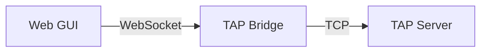
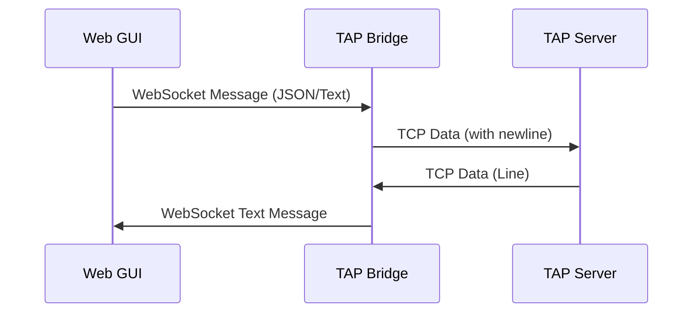

# TAP Bridge

The TAP Bridge is a specialized proxy that enables communication between the web-based Graphical User Interface (GUI) and the game server.

## Purpose

Web browsers cannot natively establish direct TCP connections. Since the TAP Server communicates over raw TCP, the Bridge acts as a WebSocket-to-TCP gateway. It translates WebSocket messages from the GUI into TCP streams for the server, and vice versa.

## Architecture

The Bridge sits between the GUI and the TAP Server, handling the protocol translation.



### Data Flow

1.  **GUI to Server**: The Bridge receives WebSocket messages (Text or Binary). Text messages are ensured to have a newline character before being forwarded to the TCP stream.
2.  **Server to GUI**: The Bridge reads the TCP stream line by line and forwards each line as a WebSocket text message to the GUI.



## Configuration

The Bridge can be configured using the following environment variables:

| Variable | Description | Default Value |
| :--- | :--- | :--- |
| `TAP_BRIDGE_ADDR` | The address and port the Bridge listens on (WebSocket). | `127.0.0.1:7878` |
| `TAP_SERVER_ADDR` | The address and port of the target TAP Server (TCP). | `127.0.0.1:4000` |

## How to Run

To start the bridge with default settings:

```bash
cd bridge
cargo run
```

To specify custom addresses:

```bash
TAP_BRIDGE_ADDR=0.0.0.0:8080 TAP_SERVER_ADDR=127.0.0.1:4000 cargo run
```
