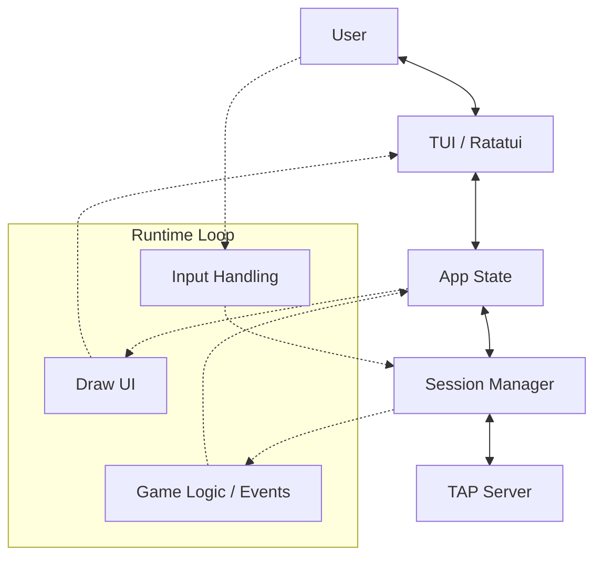
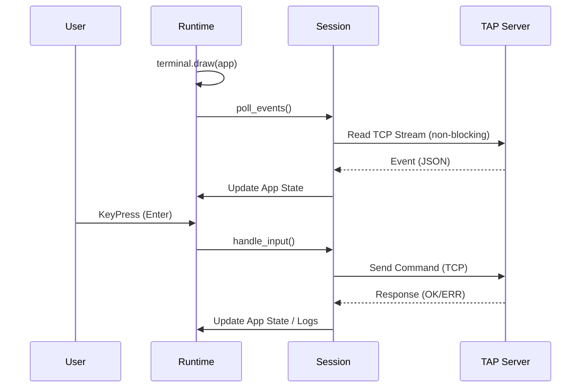

# TAP CLI

The TAP CLI is a Terminal User Interface (TUI) client for the TAP game server. It allows players to interact with the game world, chat with others, manage their inventory, and complete quests, all from the comfort of their terminal.

## Features

- **TUI Interface**: A rich terminal interface built with `ratatui` and `crossterm`.
- **Real-time Updates**: Asynchronous event polling to receive world updates, messages, and combat events in real-time.
- **Multiple Tabs**:
    - **F1 (Adventure)**: Shows the current room description, NPCs, items, and the main action log.
    - **F2 (Character)**: Displays player status, attributes, and inventory.
    - **F3 (Social)**: Lists online players and handles social interactions.
- **Command System**: Intuitive command entry with support for both explicit commands and quick-chat.
- **Automatic Connection**: Guided setup to prompt for player name and connect to the server.

## Architecture

The CLI is designed as a state-driven application with a clear separation between the network session, application state, and UI rendering.

### High-Level Overview



### Components

1.  **App State (`crate::app`)**: Holds the current state of the game world from the player's perspective (current room, inventory, logs, online players).
2.  **Session Manager (`crate::runtime::client`)**: Manages the TCP connection, handles the TAP protocol (line-based JSON), and dispatches incoming events to the App State.
3.  **UI (`crate::ui`)**: A collection of components that render the App State into the terminal.
4.  **Runtime (`crate::runtime`)**: Orchestrates the main loop, handling timing (ticks), keyboard input, and triggering UI redraws.

### Event Loop and Data Flow

The CLI uses a "game loop" approach. On every tick (default 250ms), it:
1.  Draws the UI based on the current `App` state.
2.  Polls the network for new events (e.g., another player moving, a chat message).
3.  Handles user input (keystrokes).



## Configuration

The CLI currently uses a hardcoded address for the server.

- **Server Address**: `127.0.0.1:4000` (defined in `cli/src/runtime/client/transport.rs`)

*Note: Future versions may support environment variables or command-line arguments for configuration.*

## How to Run

### Prerequisites

- [Rust](https://www.rust-lang.org/) (Cargo) installed.

### Execution

1.  Ensure the TAP Server is running.
2.  Navigate to the `cli` directory:
    ```bash
    cd cli
    ```
3.  Run the application:
    ```bash
    cargo run
    ```
4.  Follow the prompt to enter your player name.

### Controls

| Key | Action |
| :--- | :--- |
| **F1** | Switch to Adventure Tab |
| **F2** | Switch to Character Tab |
| **F3** | Switch to Social Tab |
| **Enter** | Send command / Chat message |
| **Backspace** | Delete character in input bar |
| **Esc** | Exit the application |

## Protocol Handling

The CLI communicates with the server using a line-based JSON protocol.
- **Commands**: Sent as raw text (e.g., `MOVE NORTH`, `LOOK`).
- **Responses**: Received as JSON objects.
- **Events**: Received as asynchronous JSON objects (e.g., `{"kind": "event", "data": {"event": "chat", ...}}`).
