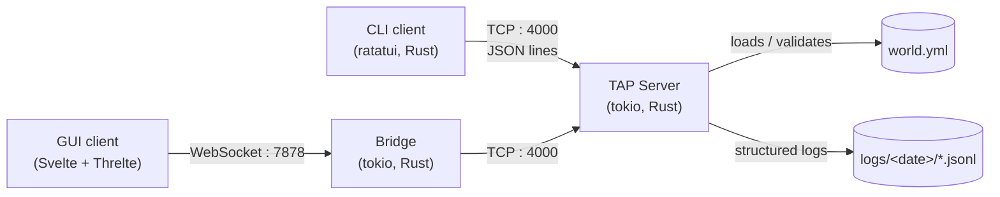
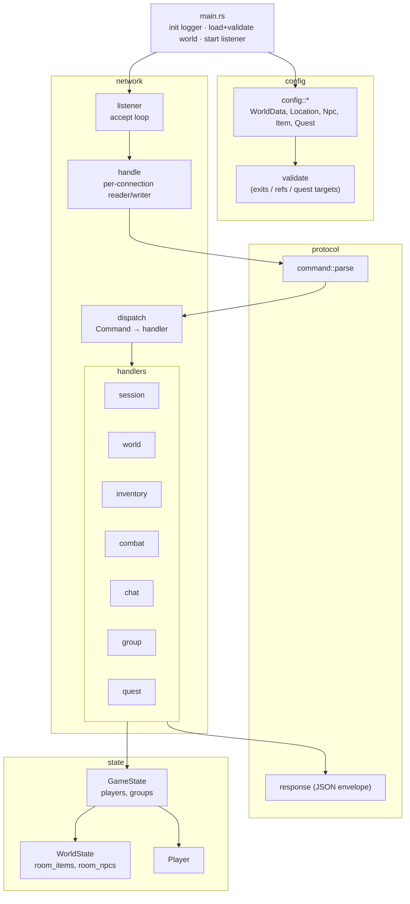
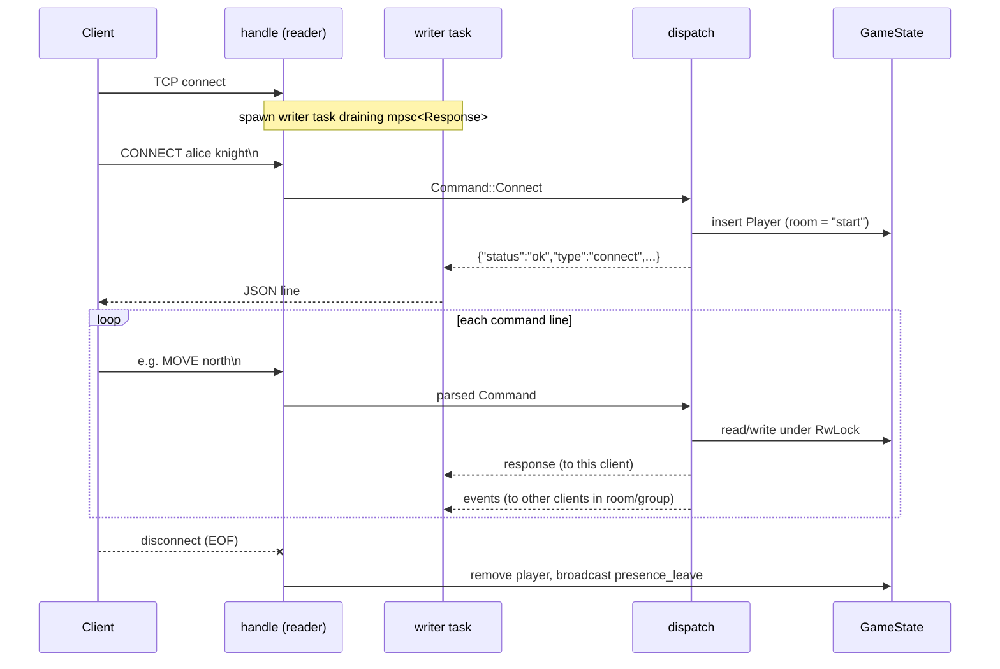
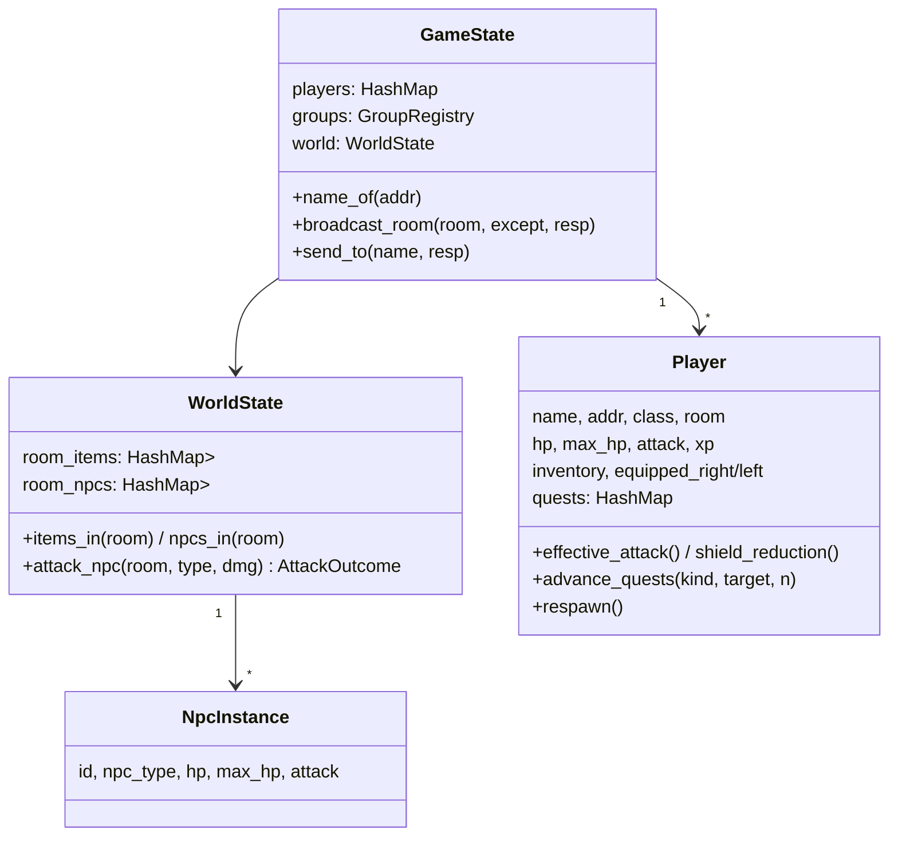
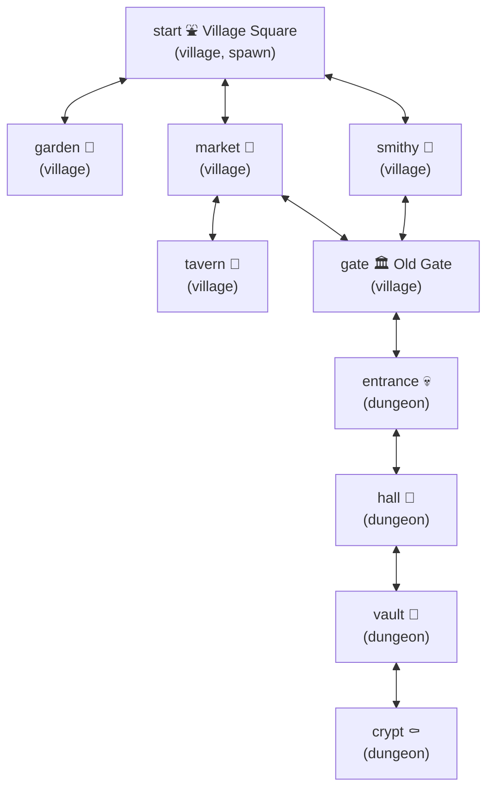
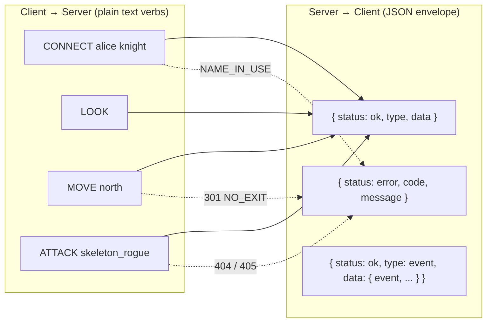
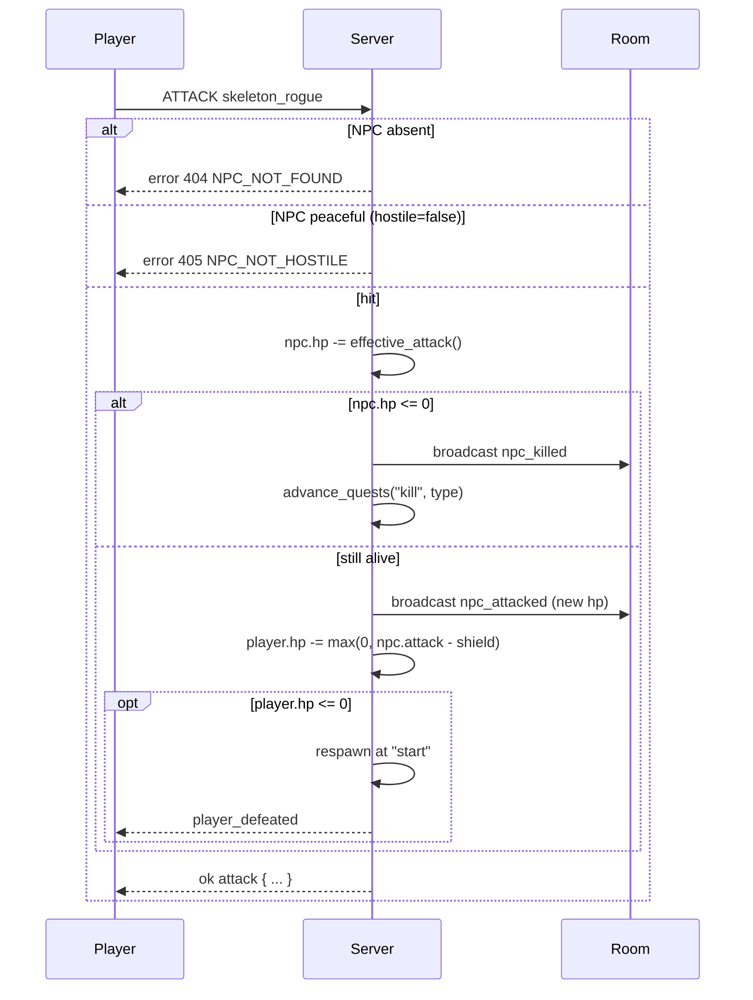
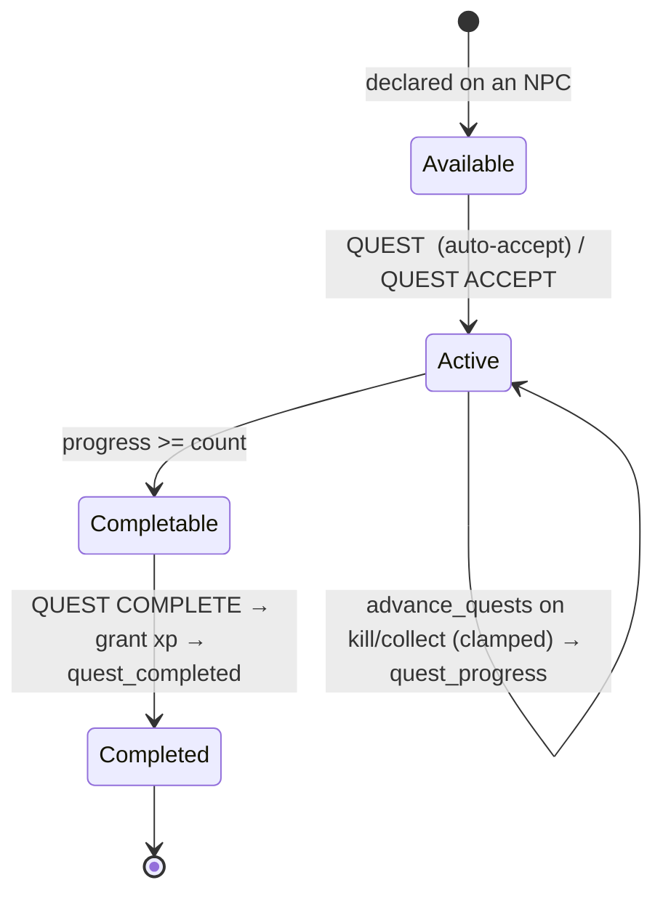
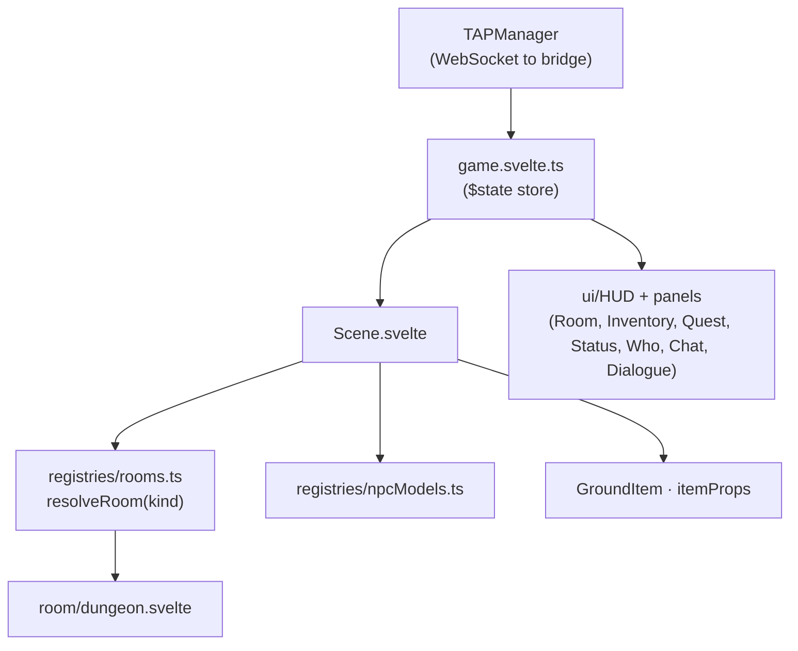

# The Answer Protocol — Technical Documentation

This document is the technical deep-dive that complements [README.md](README.md). It
explains how the system is wired together, the data model, the protocol on the wire,
and each gameplay subsystem, with diagrams.

---

## 1. System topology

Four processes cooperate. The CLI talks raw TCP; the browser GUI cannot open TCP
sockets, so it goes through the WebSocket bridge.

Both clients are **interchangeable**: they implement the same command set and consume
the same events, so any compliant client can drive the server.

---

## 2. Server module map

Handlers are small and single-purpose; `dispatch` is the only place that knows the full
command → handler mapping.

---

## 3. Connection lifecycle

The per-connection task splits the socket so that a separate writer task drains an
`mpsc` channel. This is what lets the server **broadcast without blocking** if one
client is slow or disconnects mid-send.

Per the global rules, player state is removed **before** the leave event is broadcast.

---

## 4. State model

Static, immutable data (room descriptions, NPC stats, quest definitions) lives in the
global `Config`. Mutable, per-session data (who is where, what's been picked up, which
NPCs are still alive) lives in `GameState`. `start` is special: it is hard-coded as the
spawn and respawn room, so it is always present and safe.

---

## 5. World map

The `start / market / gate / smithy` square is the loop; `garden`, `tavern`, and the
dungeon chain are branches. Rooms are themed by name/description (village vs. dungeon)
but all render with the GUI's single dungeon scene.

---

## 6. Protocol on the wire

Transport: TCP, UTF-8, one message per `\n`. Every server message is one JSON object.

This JSON envelope is the project's single, intentional deviation from RFC 42TAP's
plaintext replies; the rationale and the preserved error codes/events are documented in
the README's *Protocol Implementation* section. Key events: `presence_enter/leave`,
`chat_global/room/group`, `npc_attacked`, `npc_killed`, `player_defeated`,
`item_taken/dropped`, `quest_accepted`, `quest_progress`, `quest_completed`.

---

## 7. Combat

Deterministic, single-exchange resolution; all numbers come from world data and
equipment (see README *Combat System*).

---

## 8. Quests

Progress is server-authoritative and clamped to the required count, so a client cannot
over-report. The GUI auto-completes completable quests; the CLI exposes the lifecycle
explicitly via `QUEST` / `QUESTS`.

---

## 9. GUI architecture

`game.svelte.ts` is the single reactive store: it sends commands through `TAPManager`,
applies responses, and reacts to pushed events by refreshing the relevant slice (look,
inventory, status, quests, who). `Scene.svelte` resolves a room component by the room's
`kind` (only `dungeon` is registered) and renders NPCs, ground items, and other players
at deterministic positions (`utils/positions.ts`) on the room's 38×18 footprint.

### Lighting

The dungeon is lit by a dim ambient/hemisphere base plus warm torch point-lights around
the walls. On top of that, `Scene.svelte` adds a **per-object glow**: a cool point-light
above each NPC (brighter on hover) and a warm point-light over each ground item, so
interactable objects stand out from the gloom.
