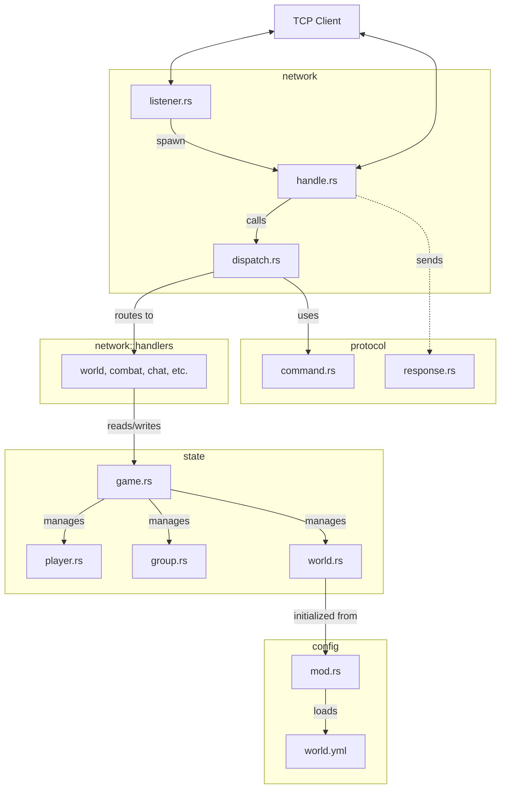

# TAP Server

The TAP Server is the core engine of the game. It manages the game world, player states, social interactions, and business logic, providing a multi-player environment via a line-based TCP protocol.

## Architecture

The TAP Server is built on an asynchronous architecture using `tokio`. It is structured into several distinct modules that handle the network layer, protocol, game state, and configuration.

### Package Overview



### Components and Data Flow

1.  **Network Layer (`network`)**:
    -   `listener.rs`: Entry point for TCP connections. For each client, an asynchronous task is spawned in `handle.rs`.
    -   `handle.rs`: Manages the connection lifecycle (read/write). It uses an `mpsc` channel to send asynchronous responses (events, broadcasts) to the client.
    -   `dispatch.rs`: The dispatcher that receives parsed commands and invokes the appropriate business logic.

2.  **Protocol (`protocol`)**:
    -   `command.rs`: Parses raw text lines sent by the client into `Command` structures.
    -   `response.rs`: Formats server responses into JSON for network transmission.

3.  **Business Logic (`network::handlers`)**:
    -   Each sub-module (e.g., `world`, `combat`, `session`) implements the game rules. They manipulate the `GameState` to perform actions and notify relevant players.

4.  **Game State (`state`)**:
    -   `GameState`: The main container, protected by an asynchronous `RwLock`. It manages the list of connected players, their sessions (`tx` channels), and groups.
    -   `WorldState`: Maintains the dynamic state of the world (items on the ground, NPC health).

5.  **Configuration (`config`)**:
    -   Loads and structures static game data (room descriptions, NPC stats) from YAML files.

## Configuration

The server behavior and world content are defined via:
- **Address**: Set to `127.0.0.1:4000` in `main.rs`.
- **World Data**: Loaded from `world.yml` (initialized in `crate::config`).

## How to Run

### Prerequisites

- [Rust](https://www.rust-lang.org/) (Cargo) installed.

### Execution

1.  Navigate to the `server` folder:
    ```bash
    cd server
    ```
2.  Start the application:
    ```bash
    cargo run
    ```
3.  The server will begin listening for connections on the configured port.
